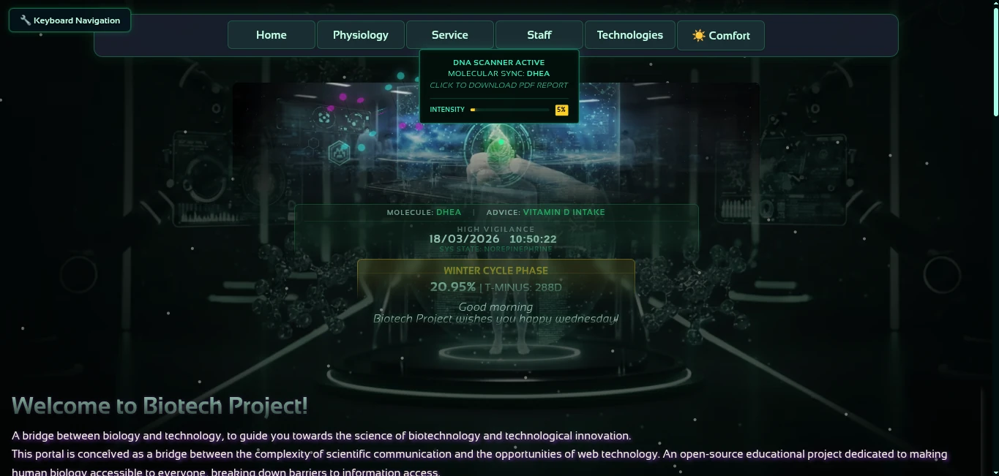

 

# BiotechProject 🧬 🇫🇷

🌐 **Lire dans d'autres langues :**  
[Italiano 🇮🇹](README.it.md) | 
[English 🇬🇧](README.md) | 
[Español 🇪🇸](README.es.md) | 
[Français 🇫🇷](README.fr.md) | 
[Deutsch 🇩🇪](README.de.md) | 
[Dutch 🇳🇱](README.nl.md) |
[Português (BR) 🇧🇷](README.pt-br.md)

> 🌍 *"Nous ne parlons pas tous la même langue, mais nous parlons la même langue : la collaboration."*  
> L'anglais n'est pas une barrière, c'est un pont.  
> 🔹 Pour contribuer ou consulter les directives du projet, rendez-vous sur les fichiers principaux en anglais :  
> - [Guide de contribution](CONTRIBUTING.md)  
> - [Code de conduite](CODE_OF_CONDUCT.md)  
> Utiliser l'anglais favorise la collaboration internationale.

**Un projet open source qui unit science, santé et technologie web.**  
Où la biotechnologie rencontre le code pour créer des outils numériques au service de la recherche et de l'innovation.

---

## 🌱 Qu'est-ce que BiotechProject ?

BiotechProject est un **laboratoire numérique ouvert** qui associe **biotechnologie, santé et développement web** en un système intégré conçu pour être :

- 🔍 **Scientifiquement fiable**
- 💻 **Techniquement robuste**
- 🌐 **Accessible à tous**, y compris les utilisateurs en situation de handicap
- 🤝 **Ouvert à la collaboration mondiale**

Il a été créé pour montrer comment la technologie peut servir la science et la santé tout en garantissant un accès équitable pour tous — indépendamment des capacités sensorielles, cognitives ou motrices.

C'est un espace collaboratif pour les développeurs, chercheurs et passionnés qui souhaitent explorer **comment le web peut devenir un outil d'inclusion et d'innovation scientifique**.

---

## 🚀 Fonctionnalités principales

✅ **Ouvert par conception**  
→ Ouvert aux contributions, idées et collaborations internationales

✅ **Intégration continue / Déploiement continu (CI/CD)**  
→ Tests, analyses et mises à jour automatiques à chaque modification

✅ **Tableau de bord des performances automatisé**  
→ Analyse continue de toutes les pages avec mise à jour de `performance-data.json`

✅ **Filtre dynamique par catégorie**  
→ Interface interactive pour explorer le niveau de maturité technologique

✅ **Conception responsive et accessible**  
→ Fonctionne sur tous les appareils, avec un fort accent sur l'ergonomie et la conformité WCAG

---

## 📊 Surveillance de la Qualité Technique & Architecture

> 📑 **Engineering Assets (Mis à jour le 17 Janvier 2026) :**
> * **[Architectural Equity & Global Resilience Report (PDF)](docs/Architectural_Equity_Resilience_Report.pdf)**
>   *Analyse stratégique sur la manière dont le "SRE for Humans" et l'ingénierie minimaliste résolvent la latence et les barrières cognitives dans la santé mondiale.*
> * **[Executive Summary: Metabolic Digital Twin Architecture (PDF)](docs/Metabolic-Digital-Twin-Executive-Summary.pdf)**

Le projet implémente un **système avancé de suivi de la maturité technologique** via GitHub Actions. Au **17 Janvier 2026**, l'écosystème maintient un **score de performance agrégé de 97%**, les modules physiologiques de base atteignant **100% en Accessibilité et Performance**.

### Fonctionnalités du Tableau de Bord
- ✅ **Suivi des Performances en Temps Réel** : Score (0–100) et temps de chargement mis à jour toutes les 24h.
- ✅ **Maturity Intelligence** : Suivi automatisé de l'état des modules (`optimized`, `compatible`, `deprecated`).
- 📈 **Prévisions** : Graphique des tendances de maturité con une projection réaliste vers l'achèvement complet (février 2026).
- 💾 **Open Data** : Exportation des analyses au format JSON/CSV pour des audits tiers.

👉 **Voir le tableau de bord en direct :** [Tech_Maturity.html](https://gitechnolo.github.io/biotechproject/Tech_Maturity.html)

---

## 🌐 Accessibilité

Le site est **conforme aux lignes directrices WCAG 2.1 niveau AA** pour toutes les pages principales.  
La conformité a été vérifiée à l’aide de :

- Audits automatisés (Lighthouse, axe, WAVE)
- Tests manuels avec lecteurs d’écran (NVDA, VoiceOver)
- Navigation complète au clavier (tabulation, maj+tabulation, entrée, espace, flèches)
- Validation du code HTML selon les standards W3C
- Vérification directe du code pour la structure sémantique et l’utilisation correcte de ARIA

Le projet est **partiellement conforme au niveau AAA**, notamment pour :
- Le contraste des couleurs (la majorité du texte dépasse le ratio 7:1)
- La structure hiérarchique des titres
- L’utilisation de textes alternatifs descriptifs

Cependant, certains critères AAA ne sont pas applicables ou requis dans le contexte actuel (ex. sous-titres pour vidéos, langage simple étendu). 

📄 **Déclaration d’accessibilité complète :**  
👉 [Lire la Déclaration d’accessibilité (EN)](https://gitechnolo.github.io/biotechproject/accessibility-en.html)  
👉 [Leggi la Dichiarazione di Accessibilità (IT)](https://gitechnolo.github.io/biotechproject/accessibility-it.html)   

### 🔍 Fonctionnalités avancées d'accessibilité

- **Scanner ADN & Audit** : Module interactif avec génération de rapport PDF structuré, `aria-label` bilingue et gestion sécurisée du focus  
- **HUD & Info-bulles dynamiques** : Explications scientifiques instantanées avec descriptions textuelles et valeurs d'intensité en pourcentage pour tous les points de données  
- **Synchronisation circadienne** : Le contenu s'adapte à l'heure et à la saison (inclinaison de l'axe), réduisant la charge cognitive grâce à des conseils biologiques contextuels   

## Accessibilité & Étude de cas

Nous nous engageons à construire une plateforme inclusive. Découvrez comment nous avons mis en œuvre la conformité WCAG 2.1 AA et le support multilingue :

## 🌍 Gestion multilingue (i18n)

BiotechProject prend en charge **plusieurs langues** grâce à un système de traduction **modulaire, léger et accessible**, conçu pour fonctionner sur des pages statiques hébergées sur GitHub Pages.

Le système permet de :
- ✅ Traduire les contenus en temps réel  
- ✅ Mémoriser la langue choisie entre les pages (comme Wikipedia ou Google)  
- ✅ Prendre en charge des versions simplifiées pour les utilisateurs dyslexiques  
- ✅ Être facilement étendu par les contributeurs  

### 🧩 Architecture du système

- **Fichiers JSON modulaires** : chaque page a son propre fichier de traduction dans `lang/`  
- **Common.json** : contient les textes partagés (menu, pied de page, bouton langue)  
- **Aucun backend** : tout fonctionne en JavaScript pur  
- **LocalStorage** : la langue sélectionnée est mémorisée  
- **`data-lang-key`** : attribut HTML pour identifier les éléments traduisibles  

## 📁 Structure du dossier `lang/`

| Page (.html) | Fichier de traduction (.json) | Remarque |
|---|---:|---|
| index.html | lang/home.json | Accueil |
| Progetti.html | lang/progetti.json | Projets |
| Staff.html | lang/staff.json | Équipe |
| Marketing.html | lang/marketing.json | Marketing |
| Tech_Maturity.html | lang/tech_maturity.json | Tableau de bord performance |
| Dermatologia.html / -semplice | lang/dermatologia.json | Principal + version simplifiée |
| Cuore.html / -semplice | lang/cuore.json | Principal + version simplifiée |
| Cellula.html / -semplice | lang/cellula.json | Principal + version simplifiée |
| Apparato_digerente.html / -semplice | lang/apparato_digerente.json | Principal + simplifiée |
| Apparato_respiratorio.html / -semplice | lang/apparato_respiratorio.json | Principal + simplifiée |
| Apparato_tegumentario.html / -semplice | lang/apparato_tegumentario.json | Principal + simplifiée |
| Sistema_linfatico.html / -semplice | lang/sistema_linfatico.json | Principal + simplifiée |
| Capelli.html / -semplice | lang/capelli.json | Nouvelles pages surveillées |
| Chaînes partagées | lang/common.json | Menu, pied de page, textes partagés |

## 📅 Date de la dernière vérification
**15 janvier 2026**

## 🔮 Mises à jour récentes (synthèse)

Principaux points :

- Tableau de bord : intégration des données Lighthouse dans data/performance-latest.json et visualisation sur Tech_Maturity.html.
- Export de données : téléchargement JSON/CSV depuis la dashboard.
- Graphiques accessibles : Chart.js avec tableaux alternatifs pour technologies d’assistance.
- Optimisations : lazy-loading, chargement différé des scripts lourds, canvas optimisé et nettoyage.
- UX & préférences : thèmes dynamiques, préférences persistantes, navigation clavier améliorée et gestion ARIA/focus.
- CI/CD & transparence : exécutions Lighthouse automatiques et données publiques pour audit.

## 💡 Vous souhaitez contribuer ?

Vous êtes le bienvenu !  
BiotechProject est un **projet ouvert à tous**, inspiré de l’esprit collaboratif de Wikipedia.

🔹 Pour commencer :
- Lisez les [**Instructions de contribution**](CONTRIBUTING.md)
- Respectez le [**Code de conduite**](CODE_OF_CONDUCT.md)

Vous pouvez aider :
- Sur le contenu scientifique
- Sur les améliorations techniques ou d’accessibilité
- Par des traductions
- En signalant des bogues ou en proposant des idées

Chaque contribution — petite ou grande — aide à rendre la science plus accessible.

---

## 🛠️ Technologies utilisées
- HTML5 sémantique
- CSS3 avec propriétés personnalisées
- JavaScript natif (aucun framework)
- ARIA 1.2 pour les interactions dynamiques
- GitHub Actions pour l’automatisation (CI/CD)
- Lighthouse pour le suivi des performances

---

## 📄 Licence

📄 Licence : [CC BY 4.0](https://creativecommons.org/licenses/by/4.0/)  
Vous êtes libre de partager, adapter et utiliser ce projet à des fins commerciales, à condition de **donner un crédit approprié**.

---

## 🙌 Auteur

Auteur : **Fabrizio** ([@Gitechnolo](https://github.com/Gitechnolo))  
Projet disponible à l’adresse : [https://github.com/Gitechnolo/biotechproject](https://github.com/Gitechnolo/biotechproject)

> « Tout le monde peut contribuer. Il suffit de respecter l’origine et de continuer à construire avec soin. »