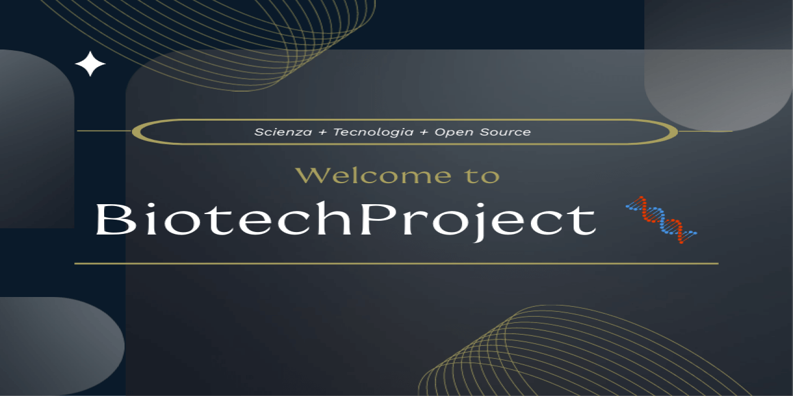

  

# BiotechProject 🧬 🇮🇹

🌐 **Leggi in altre lingue:**  
[Italiano 🇮🇹](README.it.md) | 
[English 🇬🇧](README.md) | 
[Español 🇪🇸](README.es.md) | 
[Français 🇫🇷](README.fr.md) | 
[Deutsch 🇩🇪](README.de.md) | 
[Dutch 🇳🇱](README.nl.md) |
[Português (BR) 🇧🇷](README.pt-br.md)

> 🌍 *"Benvenuti tutti. Non parliamo tutte le lingue, ma parliamo la stessa lingua: la collaborazione."*  
> L’inglese non è un ostacolo, è un ponte.  
> 🔹 Per contribuire o conoscere le linee guida del progetto, visita i file principali in inglese:  
> - [Contributing Guidelines](CONTRIBUTING.md)  
> - [Code of Conduct](CODE_OF_CONDUCT.md)  
> L'uso dell'inglese favorisce la collaborazione internazionale.

**Un progetto open source che unisce scienza, salute e tecnologia web.**  
Dove la biotecnologia incontra il codice per costruire strumenti digitali per la ricerca e l'innovazione.

   

---

## 🌱 Cos'è BiotechProject?

BiotechProject è un **laboratorio digitale aperto** che combina **biotecnologia, salute e sviluppo web** in un sistema integrato progettato per essere:

- 🔍 **Scientificamente affidabile**
- 💻 **Tecnicamente robusto**
- 🌐 **Accessibile a tutti**, inclusi utenti con disabilità
- 🤝 **Aperto alla collaborazione globale**

Nasce con l’obiettivo di dimostrare come la tecnologia possa servire la scienza e la salute, garantendo al contempo un accesso equo a chiunque, indipendentemente da capacità sensoriali, cognitive o motorie.

È uno spazio collaborativo per sviluppatori, ricercatori e appassionati che vogliono esplorare **come il web può diventare uno strumento di inclusione e innovazione scientifica**.

---

## 🚀 Funzionalità principali

✅ **Open by design**  
→ Aperto a contributi, idee e collaborazioni internazionali

✅ **Workflow CI/CD integrato**  
→ Test, analisi e aggiornamento automatico su ogni modifica

✅ **Dashboard di performance automatica**  
→ Analisi continua di tutte le pagine con aggiornamento di `performance-data.json`

✅ **Filtro dinamico per categoria**  
→ Interfaccia interattiva per esplorare lo stato di maturità tecnologica

✅ **Design responsive e accessibile**  
→ Funziona su tutti i dispositivi, con attenzione all'usabilità e ai requisiti WCAG

---

## 📊 Monitoraggio della Qualità Tecnica

Il progetto include un sistema automatico per monitorare la qualità tecnica delle pagine, con aggiornamento giornaliero tramite GitHub Actions.  
A partire da settembre 2025, è stato introdotto un **sistema avanzato di monitoraggio della maturità tecnologica del progetto**, che combina dati reali e previsioni per tracciare l'evoluzione complessiva del sito.

### Funzionalità della dashboard
- ✅ **Punteggio di performance** (0–100) per ogni pagina
- ✅ **Tempo di caricamento** e stato di ottimizzazione
- ✅ **Categoria di maturità**: `optimized`, `compatible`, `needs-improvement`, `deprecated`
- 📈 **Grafico di maturità** (dati storici + previsione fino al 100%)
- 💾 **Esportazione dati** in JSON/CSV per analisi esterne
- 🕒 Dati aggiornati ogni 24 ore (o manualmente con "Aggiorna ora")

📊 Il sistema mostra sia il **livello corrente** che una **proiezione realistica fino al completamento del ciclo di sviluppo** (previsto febbraio 2026), basata su miglioramenti effettivi (es. accessibilità, UX, ottimizzazione).

👉 Vedi la dashboard in tempo reale: [Tech_Maturity.html](https://gitechnolo.github.io/biotechproject/Tech_Maturity.html)   
   

---

## 🌐 Accessibilità

Il sito è **conforme alle Linee guida WCAG 2.1 Livello AA** per tutte le pagine principali.  
La conformità è stata verificata tramite:

- Audit automatizzati (Lighthouse, axe, WAVE)
- Test manuali con screen reader (NVDA, VoiceOver)
- Navigazione completa da tastiera (tab, shift+tab, invio, spazio, frecce)
- Validazione W3C del codice HTML
- Ispezione diretta del codice per struttura semantica e uso corretto di ARIA

Il progetto è **parzialmente conforme al Livello AAA**, in particolare per:
- Contrasto del colore (maggior parte dei testi supera il rapporto 7:1)
- Struttura gerarchica dei titoli
- Uso di testo alternativo descrittivo

Tuttavia, alcuni criteri AAA non sono applicabili o non sono richiesti nel contesto attuale (es. sottotitoli per video, testo in lingua semplice esteso).

📄 **Dichiarazione completa:**  
👉 [Leggi la Dichiarazione di Accessibilità (IT)](https://gitechnolo.github.io/biotechproject/accessibility-it.html)  
👉 [Read Accessibility Statement (EN)](https://gitechnolo.github.io/biotechproject/accessibility-en.html)

---

## Accessibilità & Case Study

Siamo impegnati a costruire una piattaforma inclusiva. Scopri come abbiamo implementato la conformità WCAG 2.1 AA e il supporto multilingue:

   

## 🌍 Gestione Multilingua (i18n)

BiotechProject supporta **più lingue** con un sistema di traduzione **modulare, leggero e accessibile**, progettato per funzionare su pagine statiche ospitate su GitHub Pages.

Il sistema permette di:
- ✅ Tradurre contenuti in tempo reale
- ✅ Ricordare la lingua scelta tra le pagine (come Wikipedia o Google)
- ✅ Supportare versioni semplici per utenti dislessici
- ✅ Essere esteso facilmente da collaboratori

### 🧩 Architettura del sistema

- **File JSON modulari**: ogni pagina ha il suo file di traduzione in `lang/`
- **Common.json**: contiene testi condivisi (menu, footer, pulsante lingua)
- **Nessun backend**: tutto funziona in JavaScript puro
- **LocalStorage**: la lingua selezionata viene ricordata
- **data-lang-key**: attributo HTML per identificare elementi traducibili

## 📁 Struttura della cartella `lang/`

Per chiarezza, la seguente tabella mappa le pagine HTML ai rispettivi file JSON di traduzione. I file JSON sono modulari: `common.json` contiene stringhe condivise (menu, footer, ecc.), mentre i file specifici contengono i testi della singola pagina.

| Pagina (.html) | File traduzione (.json) | Note |
|---|---|---|
| index.html | lang/home.json | Contenuto principale / home |
| Progetti.html | lang/progetti.json | Elenco progetti |
| Staff.html | lang/staff.json | Meet the Staff |
| Marketing.html | lang/marketing.json | Pagina Marketing |
| Tech_Maturity.html | lang/tech_maturity.json | Dashboard performance & report |
| Dermatologia.html, Dermatologia-semplice.html | lang/dermatologia.json | Contenuto principale + versione semplificata |
| Cuore.html, Cuore-semplice.html | lang/cuore.json | Contenuto + versione semplificata |
| Cellula.html, Cellula-semplice.html | lang/cellula.json | Contenuto + versione semplificata |
| Apparato_digerente.html, *-semplice.html* | lang/apparato_digerente.json | Contenuto + semplificata |
| Apparato_respiratorio.html, *-semplice.html* | lang/apparato_respiratorio.json | Contenuto + semplificata |
| Apparato_tegumentario.html, *-semplice.html* | lang/apparato_tegumentario.json | Contenuto + semplificata |
| Sistema_linfatico.html, *-semplice.html* | lang/sistema_linfatico.json | Contenuto + semplificata |
| Capelli.html, Capelli-semplice.html | lang/capelli.json | Nuove pagine incluse nel monitoraggio |
| common strings | lang/common.json | Menu, footer, pulsanti condivisi |

## 💡 Vuoi contribuire?

Benvenuto!  
BiotechProject è un progetto **aperto a tutti**, in uno spirito simile a Wikipedia.

🔹 Per iniziare:
- Leggi le [**Contributing Guidelines**](CONTRIBUTING.md)
- Rispetta il [**Code of Conduct**](CODE_OF_CONDUCT.md)

Puoi aiutare con:
- Nuovi contenuti scientifici
- Miglioramenti tecnici o di accessibilità
- Traduzioni
- Bug report e suggerimenti

---

## 🛠️ Tecnologie utilizzate
- HTML5 semantico
- CSS3 con Custom Properties
- JavaScript vanilla (zero framework)
- ARIA 1.2 per interazioni dinamiche
- GitHub Actions per CI/CD
- Lighthouse per monitoraggio performance

---

## 📄 Licenza

📄 Licenza: [CC BY 4.0](https://creativecommons.org/licenses/by/4.0/)  
Puoi condividere, modificare e usare il progetto anche a fini commerciali, purché citi l'autore originale.

- **Contenuti (testo, grafica, materiale didattico)**: [CC BY 4.0](https://creativecommons.org/licenses/by/4.0/)
- **Codice sorgente**: [Licenza MIT](https://opensource.org/licenses/MIT)

"Chiunque può contribuire. Basta rispettare l'origine e continuare a costruire con cura."   

---

## 🙌 Autore

Autore: **Fabrizio** ([@Gitechnolo](https://github.com/Gitechnolo))  
Progetto disponibile su: [https://github.com/Gitechnolo/biotechproject](https://github.com/Gitechnolo/biotechproject)

---

## ✅ Caratteristiche di accessibilità implementate

Il progetto adotta un approccio **"accessibilità fin dall’origine"** (*accessibility by design*). Tra le principali funzionalità:

- **Navigazione da tastiera completa**: Tutte le funzionalità sono accessibili tramite tastiera, con un pulsante dedicato che attiva un’evidenziazione avanzata.
- **Supporto avanzato ai menu**: Menu a tendina navigabili con frecce, <kbd>Home</kbd>, <kbd>End</kbd> e <kbd>Esc</kbd>, con gestione corretta del focus.
- **Compatibilità con screen reader**: Struttura HTML semantica, uso corretto di `ARIA` e gestione dinamica dello stato.
- **Contrasto sufficiente**: Tutti i testi rispettano il rapporto minimo 4.5:1 (testo normale) e 3:1 per elementi UI (WCAG 1.4.3, 1.4.11).
- **Testo ridimensionabile**: Funzionale fino al 200% di zoom senza sovrapposizioni (WCAG 1.4.4, 1.4.10).
- **Controllo delle animazioni**: Disattivate automaticamente con `prefers-reduced-motion: reduce`, più opzione manuale tramite pulsante “Comfort”.
- **Supporto al contrasto elevato**: Applica automaticamente un tema blu profondo se `prefers-contrast: high` è attivo (WCAG 1.4.12, livello AAA).
- **Tema visivo dinamico**: Cinque varianti cromatiche (Verde, Ciano, Viola, Arancione, Blu Profondo) per supportare diverse condizioni visive, inclusi vari tipi di daltonismo.
- **Persistenza delle preferenze**: Il tema e lo stato della navigazione da tastiera vengono salvati in `localStorage` e ripristinati alla visita successiva.
- **Popup accessibili**: Finestre modali con gestione corretta del focus, supporto a <kbd>Esc</kbd> e transizione verso `role="dialog"` per migliorare l’accessibilità.
- **Lazy loading sicuro**: Immagini caricate con `IntersectionObserver`, fallback per browser vecchi, e testo alternativo sempre presente.
- **Orologi e contatori accessibili**: Aggiornati dinamicamente con `aria-live="polite"` per screen reader.
- **Design resiliente**: Zero framework esterni. JavaScript vanilla, CSS moderno ma retrocompatibile, HTML semantico.
- **Pagine semplificate**: Versioni con linguaggio chiaro, frasi brevi e supporto visivo per utenti con dislessia o difficoltà cognitive (WCAG 3.1.5).
- **Accessibilità dei dati visivi**: Grafici accompagnati da tabelle nascoste (`visually-hidden`) e testi alternativi strutturati.
- **Esportazione dati**: Possibilità di esportare dati di performance e accessibilità in JSON o CSV per audit trasparenti.
- **Comfort visivo automatico (QRedshift)**: Filtro di temperatura colore più caldo la sera, basato sull’ora locale, disattivabile manualmente.
- **Supporto alla pronuncia e comprensione**: Uso del tag `<ruby>` per definizioni e pronuncia di termini scientifici complessi (WCAG 3.1.3, 3.1.5).
- **Video accessibile**: Senza autoplay, controlli personalizzati con `aria-label`, descrizioni testuali e navigazione da tastiera.

## 🚀 Conformità in corso verso WCAG 2.1 Livello AAA

Stiamo implementando ulteriori miglioramenti per avvicinarci al livello **AAA**:

- **Pronuncia di termini tecnici**: Espansione dell’uso di `<ruby>` con sillabazione e IPA (es. "CRISPR", "epigenetica").
- **Spiegazione di acronimi**: Implementazione progressiva di `<abbr title="...">` per sigle come "PCR", "ATP", "DNA".
- **Link con testo descrittivo**: Verifica continua che ogni link sia comprensibile anche fuori contesto (WCAG 2.4.9).
- **Migrazione da popup a modali accessibili**: Sostituzione di `window.open()` con modali interni dotati di `role="dialog"`, trapping del focus e supporto completo da tastiera.   

## ⚠️ Non conformità parziali o eccezioni

Nonostante l’impegno, alcune parti non soddisfano pienamente tutti i criteri WCAG:

- **Uso di `role="menu"` nei dropdown**: Attualmente utilizzato per un comportamento avanzato da tastiera, ma tecnicamente riservato a barre dei menu applicativi. In valutazione una transizione a un modello semantico più semplice e compatibile.
- **Popup basati su `window.open()`**: Alcuni link aprono finestre esterne per retrocompatibilità con sistemi legacy. In fase di migrazione verso modali interni accessibili.

## 💬 Feedback e segnalazioni

Il tuo feedback è fondamentale per migliorare l’accessibilità del progetto.  
Se riscontri barriere nell’accesso ai contenuti o hai suggerimenti, [contattaci](https://gitechnolo.github.io/biotechproject/accessibility-it.html#feedback) (sezione "Feedback e segnalazioni" della dichiarazione).

## 📅 Data dell’ultima verifica
**8 Novembre 2025**   

## 🔮 Aggiornamenti recenti (sintesi)

Breve riepilogo delle novità più rilevanti implementate recentemente:

- Dashboard performance: integrazione dei risultati Lighthouse in data/performance-latest.json e visualizzazione aggregata su Tech_Maturity.html (grafico + lista pagine con punteggi).
- Esportazione dati: possibilità di scaricare in JSON/CSV dalla dashboard (pulsante "Esporta dati").
- Visualizzazione & accessibilità dei dati: grafici con Chart.js accompagnati da tabelle alternative per screen reader.
- Ottimizzazioni di performance: lazy-loading, caricamento differito degli script pesanti, ottimizzazioni del canvas delle particelle (frame-rate ridotto e cleanup).
- UX & preferenze: tema dinamico, persistenza preferenze (localStorage), navigazione da tastiera migliorata e gestione focus/ARIA.
- Trasparenza e CI/CD: pipeline che genera automaticamente i dati di performance (generate-performance.js → performance-latest.json); dati disponibili pubblicamente per audit indipendenti.

---

📌 **Progetto**  
🔧 Tecnologie: HTML5, CSS3, JavaScript vanilla, ARIA, W3C standards  
🌍 Hosting: GitHub Pages  
📄 Licenza: [CC BY 4.0](https://creativecommons.org/licenses/by/4.0/) — Puoi condividere, modificare e usare il progetto anche a fini commerciali, purché citi l'autore originale.
