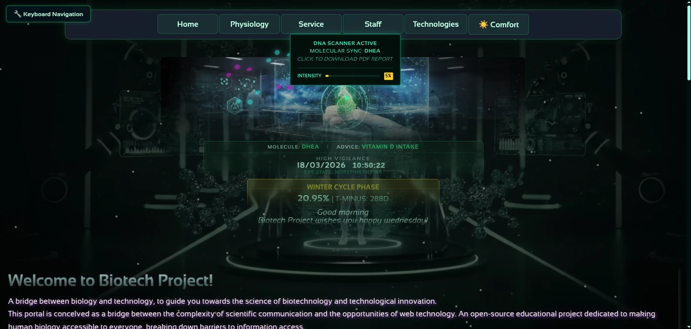
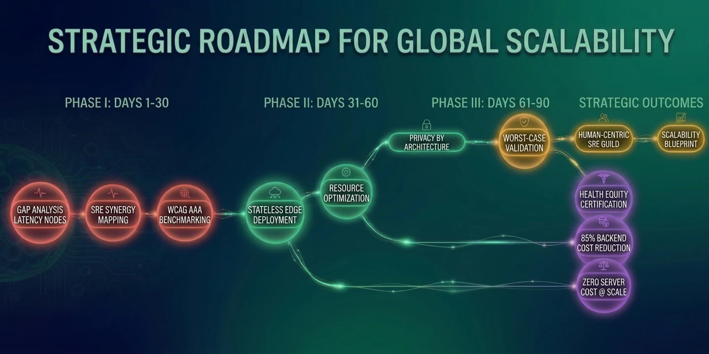
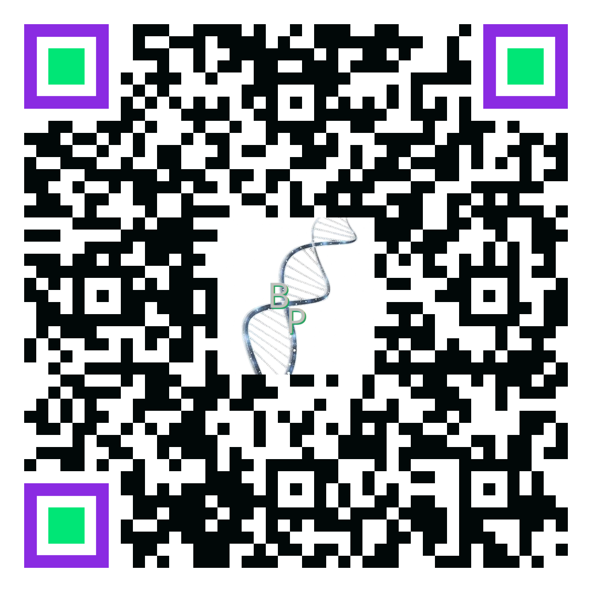

<div align="center">
  
</div>

# BiotechProject 🧬 🇳🇱
[](https://github.com/Gitechnolo/biotechproject/actions)
[](https://github.com/sponsors/Gitechnolo)
[](https://gitechnolo.github.io/biotechproject/accessibility-en.html)

🌐 **Lees in andere talen:**  
[Italiano 🇮🇹](README.it.md) | 
[English 🇬🇧](README.md) | 
[Español 🇪🇸](README.es.md) | 
[Français 🇫🇷](README.fr.md) | 
[Deutsch 🇩🇪](README.de.md) | 
[Dutch 🇳🇱](README.nl.md) |
[Português (BR) 🇧🇷](README.pt-br.md)

> 💡 **Uitvoerende Samenvatting (27 maart 2026):**
>
> Dit project is geëvolueerd van een prestatiegericht experiment naar een **Strategisch Blauwdruk voor Veerkrachtige Gezondheidsarchitectuur**.  
> We hebben onze "Stateless Edge" methodologie geformaliseerd in een nieuw rapport dat wereldwijde gezondheidsongelijkheden aanpakt veroorzaakt door latentie en cognitieve barrières.  
>
> 👉 **Lees het Strategische Rapport:** [Architectural Equity & Global Resilience Report (PDF)](docs/Architectural_Equity_Resilience_Report.pdf)


> 🌍 *"We spreken niet allemaal dezelfde talen, maar we spreken dezelfde taal: samenwerking."*  
> Engels is geen barrière - het is een brug.  
> 🔹 Om bij te dragen of de projectrichtlijnen te bekijken, bezoek de hoofdbestanden in het Engels:  
> - [Contributing Guidelines](CONTRIBUTING.md)  
> - [Code of Conduct](CODE_OF_CONDUCT.md)  
> Engels gebruiken ondersteunt internationale samenwerking.

**Een open source project dat wetenschap, gezondheid en webtechnologie verenigt.**  
Waar biotechnologie ontmoet code om digitale tools te bouwen voor onderzoek en innovatie.

[](https://github.com/Gitechnolo/biotechproject/blob/main/LICENSE-MIT.md)
[](https://github.com/Gitechnolo/biotechproject/actions/workflows/performance.yml)
[](https://github.com/Gitechnolo/biotechproject/commits)
[](https://github.com/Gitechnolo/biotechproject/security)
[](https://github.com/Gitechnolo/biotechproject/security)

> [!TIP]
> ** Mijlpaal: Bijdrage aan het Wereldwijde Ecosysteem (31 maart 2026)**
> 
> We hebben officieel de workflow **"Resilient WCAG 2.2 AAA Audit (Stateless Edge)"** geformaliseerd binnen de BiotechProject Roadmap.  
> Deze architecturale beslissing - **[ADR-007 | Issue #20](https://github.com/Gitechnolo/biotechproject/issues/20)** - stelt een hoog-risico toegankelijkheidsstandaard vast die is ontworpen voor klinische veerkracht in omgevingen met lage bandbreedte en kritieke gezondheidszorg.
> 
> *Ontwikkeld en onderhouden door onze **Lead Architect**, deze standaard is nu open voor expertvalidatie en wereldwijde implementatie als onderdeel van onze visie voor Veerkracht en Schaalbaarheid 2026.*

---

## 🌱 Wat is BiotechProject?

BiotechProject is een **open digitaal lab** dat **biotechnologie, gezondheid en webontwikkeling** combineert in een geïntegreerd systeem dat ontworpen is om te zijn:

- 🔍 **Wetenschappelijk betrouwbaar**
- 💻 **Technisch robuust**
- 🌐 **Toegankelijk voor iedereen**, inclusief gebruikers met handicaps
- 🤝 **Open voor wereldwijde samenwerking**

Het is gecreëerd om te demonstreren hoe technologie wetenschap en gezondheidszorg kan dienen, terwijl gelijke toegang voor iedereen wordt gegarandeerd – ongeacht sensorische, cognitieve of motorische vaardigheden.

Het is een collaboratieve ruimte voor ontwikkelaars, onderzoekers en enthousiastelingen die willen verkennen **hoe het web een instrument kan worden voor inclusie en wetenschappelijke innovatie**.

<div align="center">
  <h3>🗺️ Onze Strategische Visie voor Schaalbaarheid</h3>
  
</div>

## 🗺️ Strategische Roadmap & Evolutie
Om transparantie en betrouwbaarheid van klinische kwaliteit te waarborgen, volgen we onze langetermijnmijlpalen via een openbare roadmap. Dit zorgt ervoor dat onze visie "Resilience & Scalability 2026" in lijn blijft met de wereldwijde normen voor rechtvaardigheid in de gezondheidszorg.

👉 **Bekijk de Volledige Strategische Roadmap:** [BiotechProject Roadmap 2026](https://github.com/users/Gitechnolo/projects/2/views/1)

---

## 🚀 Belangrijkste Kenmerken

✅ **Open by design**  
→ Open voor bijdragen, ideeën en internationale samenwerking

✅ **Geïntegreerde CI/CD workflow**  
→ Geautomatiseerde testen, analyse en updates bij elke wijziging

✅ **Geautomatiseerd performance dashboard**  
→ Continue analyse van alle pagina's met updates naar `performance-data.json`

✅ **Dynamische filter per categorie**  
→ Interactieve interface om technologische maturiteitsstatus te verkennen

✅ **Responsive en toegankelijk ontwerp**  
→ Werkt op alle apparaten, met sterke focus op bruikbaarheid en WCAG compliance

✅ **Privacy-by-Architecture**
→ 100% client-side gegevensverwerking zorgt ervoor dat bio-gevoelige gegevens nooit de browser van de gebruiker verlaten, afgestemd op GDPR/HIPAA standaarden by design.

---

## 🎯 Doelgroep en Strategische Visie

BiotechProject is ontworpen voor stakeholders die veerkracht als een klinische vereiste beschouwen:

* **Gezondheidssystemen en Gezondheidsinitiatieven**: Ontworpen om metabolische digitale tweelingen te schalen met nul server-side compute kosten, gebruikmakend van high-performance Vanilla JS voor complexe client-side logica.
* **Wereldwijde Gezondheidsequiteit**: Specifiek ontworpen voor gebruikers in regio's met lage connectiviteit, zorgen voor sub-seconde (0,3s) laadtijden zelfs op legacy apparaten door SRE-grade optimalisatie.
* **Neurodivergente Patiënten**: Ontworpen met native **WCAG 2.2 AAA Gold Standard** principes. Onze stateless architectuur en 'Comfort Mode' leveren een cognitief veilige en sensorisch geoptimaliseerde omgeving.
* **SRE en Systeemingenieurs**: Een blauwdruk voor "SRE-for-Humans", waar performance metrics (95% aggregate score) worden behandeld als een commitment voor gebruikersinclusie en betrouwbaarheid.

---

## 🏗 Architectural Decision Records (ADR)

Dit project volgt een rigoureus besluitvormingsproces om enterprise-grade veerkracht te waarborgen. Elke beslissing wordt cross-gevalideerd voor architecturale integriteit.

| ID | Beslissing | Kern Uitkomst | Validatie |
| :--- | :--- | :--- | :--- |
| **001** | **Zero-Framework Mandate** | < 20KB Bundle / 0.3s TTI | [Issue #12](https://github.com/Gitechnolo/biotechproject/issues/12) |
| **002** | **Stateless Edge Intelligence** | 100% Service Availability | [Issue #13](https://github.com/Gitechnolo/biotechproject/issues/13) |
| **003** | **AI-Assisted SRE Auditing** | 87% Tech Maturity Score | [Issue #14](https://github.com/Gitechnolo/biotechproject/issues/14) |
| **004** | **Circadian State Machine** | 98% CPU Cycle Reduction | [Issue #15](https://github.com/Gitechnolo/biotechproject/issues/15) |
| **005** | **SRE-Driven Data Portability** | Zero-Latency Data Export | [Issue #17](https://github.com/Gitechnolo/biotechproject/issues/17) |
| **006** | **AAA Accessibility Baseline** | Full WCAG 2.2 Compliance | [Issue #19](https://github.com/Gitechnolo/biotechproject/issues/19) |
| **007** | **Stateless Edge WCAG 2.2 AAA Audit** | Ultra-lichte (~2KB) toegankelijkheidsaudit via Copilot voor klinische omgevingen met een lage bandbreedte. | [Issue #20](https://github.com/Gitechnolo/biotechproject/issues/20) |
| **008** | **Infrastructure: Nightly SRE Reliability Gate** | Implementatie van een geautomatiseerde integriteitspoort voor architecturale onveranderlijkheid en 24u-validatie. | [Issue #21](https://github.com/Gitechnolo/biotechproject/issues/21) |

<details>
<summary><b>Klik om uit te vouwen: Volledige ADR Rechtvaardiging</b></summary>

### [ADR-001] Zero-Framework Mandate
* **Beslissing**: Vermijd moderne frameworks (React/Angular/Vue) ten gunste van pure **Vanilla JS (ES6+)**.
* **Rechtvaardiging**: Elimineert de "framework tax". In gezondheid-kritische contexten is sub-seconde interactiviteit een klinische vereiste.
* **Uitkomst**: Initiële bundle grootte **< 20KB** en TTI van **0.3s**.
* **Validatie**: [View Engineering Log (#12)](https://github.com/Gitechnolo/biotechproject/issues/12)

### [ADR-002] Stateless Edge & Client-Side Intelligence
* **Beslissing**: Migreer complexe metabolische en biologische sync logica volledig naar de client-side.
* **Rechtvaardiging**: Garandeert **100% service beschikbaarheid** tijdens netwerkpieken of backend storingen.
* **Uitkomst**: 85% reductie in infrastructuurkosten.
* **Validatie**: [View Resilience Report (#13)](https://github.com/Gitechnolo/biotechproject/issues/13)

### [ADR-003] AI-Assisted SRE Auditing
* **Beslissing**: Multi-model orchestration (Gemini + Copilot) voor code review.
* **Rechtvaardiging**: Overwint individuele LLM hallucinaties via "consensus" op type safety.
* **Uitkomst**: 87% technische maturiteit score.
* **Validatie**: [View Audit Protocol (#14)](https://github.com/Gitechnolo/biotechproject/issues/14)

### [ADR-004] Circadian State Machine
* **Beslissing**: Implementatie van een resource-efficient **Early Return pattern**.
* **Rechtvaardiging**: Vermindert cognitieve belasting zonder dure re-renders of zware polling te triggeren.
* **Uitkomst**: 98% reductie in background CPU cycles.
* **Validatie**: [View Performance Pattern (#15)](https://github.com/Gitechnolo/biotechproject/issues/15)

### [ADR-005] SRE-Driven Data Portability
* **Beslissing**: Deployment van een zero-latency export layer met native Blob APIs.
* **Rechtvaardiging**: Zorgt voor gegevenssoevereiniteit voor gezondheidsdossiers met "Lean Logic" (geen libraries).
* **Uitkomst**: Instant CSV/JSON generatie.
* **Validatie**: [View Export Strategy (#17)](https://github.com/Gitechnolo/biotechproject/issues/17)

### [ADR-006] AAA Accessibility Baseline
* **Beslissing**: Implementatie van **WCAG 2.2 Level AAA Gold Standard** compliance, inclusief Enhanced Focus Appearance en cognitieve support patronen.
* **Rechtvaardiging**: Brengt digitale inclusie voor klinische software naar het hoogste niveau, met gegarandeerde cognitieve veiligheid en sensorische optimalisatie.
* **Uitkomst**: Volledige WCAG 2.2 conformiteit.
* **Validatie**: [View Accessibility Statement (#19)](https://github.com/Gitechnolo/biotechproject/issues/19)

### [ADR-007] Resilient WCAG 2.2 AAA Audit (Stateless Edge)
* **Besluit**: Stateless Edge WCAG 2.2 AAA Audit
* **Motivering**: De "Zero-Framework" aanpak elimineert zware externe bibliotheken, terwijl de "Semantic Snapshotter" de interfacestatus efficiënt vastlegt. Dit vermindert de afhankelijkheid van infrastructuur en bevordert de gelijkheid in de gezondheidszorg (Health Equity) in regio's met beperkte connectiviteit.
* **Resultaat**: Ultra-lichte (~2KB) toegankelijkheidsaudit via Copilot, wat de werking in klinische omgevingen met een lage bandbreedte garandeert.
* **Validatie**: [Bekijk Issue #20](https://github.com/Gitechnolo/biotechproject/issues/20)

### [ADR-008] Infrastructure: Nightly SRE Reliability Gate & Immutable Integrity
* **Besluit**: Implementatie van een geautomatiseerde "Nightly SRE Reliability Gate".
* **Rechtvaardiging**: Garandeert dat 100% Lighthouse-scores en WCAG 2.2 AAA-conformiteit niet worden aangetast door regressies. In klinische omgevingen is software-integriteit (Immutable Integrity) een kritieke veiligheidseis voor systeemveerkracht.
* **Resultaat**: Geautomatiseerde 24-uurs validatiecyclus met "Zero-Tolerance" voor prestatie- of toegankelijkheidsverlies.
* **Validatie**: [View Issue #21](https://github.com/Gitechnolo/biotechproject/issues/21)

</details>

---

## 📊 Technische Kwaliteitsmonitoring en Architectuur

Het project implementeert een **geavanceerd technologisch maturiteit tracking systeem** via GitHub Actions. Vanaf **28 maart 2026**, onderhoudt het ecosysteem een **95% geaggregeerde performance score**.

> [!IMPORTANT]
> **Performance Stress-Test:** Metrics worden gevalideerd onder **extreme synthetische throttling** (150ms RTT / 4x CPU vertraging). Deze SRE-grade audit zorgt ervoor dat kern klinische modules toegankelijk en performant blijven zelfs tijdens piek-uur netwerkinstabiliteit of op legacy hardware.

**Update 27 maart 2026:** Succesvol geïntegreerd de **Data Portability Audit layer (ADR-005)**. Het systeem ondersteunt nu real-time performance telemetry exports zonder de Main Thread uitvoering te beïnvloeden.

📂 **Laatste Audit Records:**
* 📄 **[SRE Performance Stress-Test Report - 27 maart 2026 (PDF)](docs/biotech-performance-report.pdf)**
* 📄 **[Executive Summary: Metabolic Digital Twin Architecture (PDF)](docs/Metabolic-Digital-Twin-Executive-Summary.pdf)**

### Dashboard Kenmerken
* ✅ **Real-time Performance Monitoring**: Metrics (0–100) bijgewerkt elke 24h via GitHub Actions.
* ✅ **Resilience Intelligence**: Geautomatiseerde tracking van `optimized` en `compatible` statussen onder stress.
* 💾 **Open Data & Transparantie**: Toegang tot de **[Raw Performance Dataset (JSON)](https://github.com/Gitechnolo/biotechproject/blob/main/data/performance-latest.json)** voor third-party verificatie of download analytics direct van de UI.

👉 **Bekijk het live dashboard:** [Tech_Maturity.html](https://gitechnolo.github.io/biotechproject/Tech_Maturity.html)

<details>
<summary><b>📸 Scannen voor mobiele toegang (AAA-standaard)</b></summary>
<div align="center">
  <br>
  
  <p><i>Richt uw camera om de prestaties en WCAG 2.2 AAA-toegankelijkheid in realtime te controleren op uw smartphone.</i></p>
</div>
</details>

---

## 📂 Navigatiehub (Geoptimaliseerde Assets)

> [!TIP]
> Deze sectie biedt een gestroomlijnde interface om toegang te krijgen tot de geminificeerde productie assets. Voor ontwikkelingsbestanden, raadpleeg de `src/` directory.

### 🛡️ Geverifieerde Productie Assets

[](https://github.com/Gitechnolo/biotechproject/actions)
> [!IMPORTANT]  
> **Methodologische Opmerking:** De datums vermeld in de "Last Audit" kolom vertegenwoordigen de meest recente **Global System Validation**. Dit omvat geautomatiseerde beveiligingsscans, performance stress-tests (Lighthouse), en link integriteit controles. Zelfs als de inhoud van een specifiek asset ongewijzigd blijft, wordt de betrouwbaarheid tijdens elke auditcyclus hergecertificeerd.

<details>
<summary><b>🧬 Anatomie en Biologische Systemen (Standaard & Easy-Read)</b></summary>

| Systeem | ⚡ Wetenschappelijke standaard | 📝 Dyslexie-vriendelijk | 📅 Laatste Audit |
| :--- | :--- | :--- | :--- |
| **Spijsverteringssysteem** | [Bekijk](https://gitechnolo.github.io/biotechproject/Apparato_digerente.html) | [Easy-Read](https://gitechnolo.github.io/biotechproject/Apparato_digerente-semplice.html) | 2026-03-28 |
| **Ademhalingssysteem** | [Bekijk](https://gitechnolo.github.io/biotechproject/Apparato_respiratorio.html) | [Easy-Read](https://gitechnolo.github.io/biotechproject/Apparato_respiratorio-semplice.html) | 2026-03-28 |
| **Huidstelsel** | [Bekijk](https://gitechnolo.github.io/biotechproject/Apparato_tegumentario.html) | [Easy-Read](https://gitechnolo.github.io/biotechproject/Apparato_tegumentario-semplice.html) | 2026-03-28 |
| **Lymfestelsel** | [Bekijk](https://gitechnolo.github.io/biotechproject/Sistema_linfatico.html) | [Easy-Read](https://gitechnolo.github.io/biotechproject/Sistema_linfatico-semplice.html) | 2026-03-28 |
| **Hart / Hart** | [Bekijk](https://gitechnolo.github.io/biotechproject/Cuore.html) | [Easy-Read](https://gitechnolo.github.io/biotechproject/Cuore-semplice.html) | 2026-03-28 |
| **Celbiologie** | [Bekijk](https://gitechnolo.github.io/biotechproject/Cellula.html) | [Easy-Read](https://gitechnolo.github.io/biotechproject/Cellula-semplice.html) | 2026-03-28 |
| **Dermatologie** | [Bekijk](https://gitechnolo.github.io/biotechproject/Dermatologia.html) | [Easy-Read](https://gitechnolo.github.io/biotechproject/Dermatologia-semplice.html) | 2026-03-28 |
| **Haar** | [Bekijk](https://gitechnolo.github.io/biotechproject/Capelli.html) | [Easy-Read](https://gitechnolo.github.io/biotechproject/Capelli-semplice.html) | 2026-03-28 |

</details>

<details>
<summary><b>🛠️ Project Management en Utilities</b></summary>

| Resource | Toegang Link | 📅 Laatste Audit |
| :--- | :--- | :--- |
| 🚀 **Tech Maturity Score** | [Interactief Dashboard](https://gitechnolo.github.io/biotechproject/Tech_Maturity.html) | 2026-03-28 |
| 📈 **Marketing Strategie** | [Strategische Analyse](https://gitechnolo.github.io/biotechproject/Marketing.html) | 2026-03-28 |
| 🏗️ **Project Portfolio** | [Project Overzicht](https://gitechnolo.github.io/biotechproject/Progetti.html) | 2026-03-28 |
| 👥 **Staff en Team** | [Governance en Leden](https://gitechnolo.github.io/biotechproject/Staff.html) | 2026-03-28 |
| 💬 **Tablet Forum** | [Community Discussie](https://gitechnolo.github.io/biotechproject/Tablet_forum.html) | 2026-03-28 |

</details>

<details>
<summary><b>♿ Toegankelijkheid en Inclusie</b></summary>

- 🇮🇹 **Dichiarazione di Accessibilità**: [Leggi (IT)](https://gitechnolo.github.io/biotechproject/accessibility-it.html) — *Bijgewerkt: 2026-03-28*
- 🇬🇧 **Accessibility Statement**: [Read (EN)](https://gitechnolo.github.io/biotechproject/accessibility-en.html) — *Bijgewerkt: 2026-03-28*
- ✨ **Special Modules**: [Specials](https://gitechnolo.github.io/biotechproject/Specials.html) — *Bijgewerkt: 2026-03-28*

</details>

---

## 🌐 Toegankelijkheid

De site is **conform het WCAG 2.2 Level AAA Gold Standard** voor alle hoofdpagina's.  
Conformiteit is geverifieerd door:

- Geautomatiseerde audits (Lighthouse, axe, WAVE)
- Handmatige testen met schermlezers (NVDA, VoiceOver)
- Volledige toetsenbordnavigatie (tab, shift+tab, enter, space, arrows)
- W3C code validatie
- Directe code inspectie voor semantische structuur en correct ARIA gebruik

Het project is **gedeeltelijk conform Level AAA**, met name in:
- Kleurcontrast (meeste tekst overschrijdt 7:1)
- Hiërarchische kopstructuur
- Gebruik van beschrijvende alternatieve tekst

Echter, sommige AAA criteria zijn niet van toepassing of vereist in de huidige context (bijv. video ondertitels, uitgebreide plain language).   

📄 **Volledige toegankelijkheidsverklaring:**  
👉 [Read Accessibility Statement (EN)](https://gitechnolo.github.io/biotechproject/accessibility-en.html)  
👉 [Leggi la Dichiarazione di Accessibilità (IT)](https://gitechnolo.github.io/biotechproject/accessibility-it.html)


### 🔍 Geavanceerde Toegankelijkheidsfuncties

- **DNA Scanner & Audit**: Interactieve module met gestructureerde PDF Rapport generatie, bilaterale `aria-label`, en veilige focus management  
- **HUD & Dynamische Tooltips**: Instant wetenschappelijke uitleg met tekstuele beschrijvingen en percentage intensiteit waarden voor alle datapunten  
- **Circadian Synchrony**: Inhoud past zich aan aan tijd en seizoen (axiale tilt), vermindert cognitieve belasting via biologisch contextbewuste advies

---

## Toegankelijkheid en Case Study

We zijn toegewijd aan het bouwen van een inclusieve platform. Verken hoe we het **WCAG 2.2 AAA Gold Standard** en meertalige ondersteuning hebben geïmplementeerd:

[](https://github.com/Gitechnolo/biotechproject/discussions/4)


### 🎓 Academische Samenwerking
We hebben intern al de **WCAG 2.2 AAA Gold Standard** bereikt en de technische validatie afgerond; onze samenwerking met de **HAN University of Applied Sciences (School of IT and Media Design)** richt zich nu op **academische peer-review**. Dit versterkt onze validatieketen en onze veerkrachtige open source roadmap.

> [!NOTE]
> ### 🏛️ Institutionele & Academische Hub
> Bent u een onderzoeker of vertegenwoordiger van een universiteit? Wij hebben een specifiek kader opgesteld voor academische samenwerking, audits en afstudeerprojecten.
> 
> 👉 **Bekijk het Samenwerkingskader:** [Institutional Collaboration Charter (PDF)](docs/Institutional_Collaboration_Charter_2026.pdf)
> 
> Dit document bevat details over onze drie samenwerkingstrajecten: **Graduation Project**, **Research Lab** en **Joint Grant Partnerships**.


## 🌍 Meertalig Beheer (i18n)

BiotechProject ondersteunt **meerdere talen** door een **modulaire, lichte en toegankelijke** vertalingssysteem, ontworpen om naadloos te werken op statische pagina's gehost op GitHub Pages.
"Terwijl tekstinhoud volledig gelokaliseerd is, prioriteren wetenschappelijke diagrammen momenteel Italiaans/Engelse versies om technische nauwkeurigheid te behouden tijdens de snelle evolutie van het project."

Het systeem stelt in staat:
- ✅ Real-time content vertaling  
- ✅ Persistent taalselectie tussen pagina's (zoals Wikipedia of Google)  
- ✅ Ondersteuning voor vereenvoudigde versies voor dyslectische gebruikers  
- ✅ Gemakkelijke uitbreiding door contribuanten  

### 🧩 Systeemarchitectuur

- **Modulaire JSON bestanden**: elke pagina heeft zijn eigen vertalingsbestand in de `lang/` directory  
- **Common.json**: bevat gedeelde teksten (menu, footer, taal knop)  
- **Geen backend vereist**: alles draait in pure JavaScript  
- **LocalStorage**: onthoudt de geselecteerde taal van de gebruiker  
- **`data-lang-key`**: HTML attribuut om vertaalbare elementen te identificeren  

### 📁 Structuur van de `lang/` folder

`common.json` bevat gedeelde strings (menu, footer, etc.), pagina bestanden bevatten per-pagina tekst.

```text
lang/
├── common.json                  # Shared strings (menu, footer, UI)
│
├── home.json                    # index.html
├── progetti.json                # Progetti.html
├── staff.json                   # Staff.html
├── marketing.json               # Marketing.html
├── tech_maturity.json           # Tech_Maturity.html
│
├── dermatologia.json            # Dermatologia.html + Dermatologia-semplice.html
├── cuore.json                   # Cuore.html + Cuore-semplice.html
├── cellula.json                 # Cellula.html + Cellula-semplice.html
├── apparato_digerente.json      # Apparato_digerente.html + -semplice.html
├── apparato_respiratorio.json   # Apparato_respiratorio.html + -semplice.html
├── apparato_tegumentario.json   # Apparato_tegumentario.html + -semplice.html
├── sistema_linfatico.json       # Sistema_linfatico.html + -semplice.html
└── capelli.json                 # Capelli.html + Capelli-semplice.html
```


## 📅 Laatste Verificatie Datum
**2 April 2026**

## 🔮 Recente updates (samenvatting)

Belangrijke recente verbeteringen (beknopt):

- Performance dashboard: Lighthouse data geïntegreerd in data/performance-latest.json en gevisualiseerd op Tech_Maturity.html (grafiek + pagina lijst + export).
- Data export: JSON/CSV export van dashboard ("Export data").
- Grafieken + toegankelijkheid: Chart.js grafieken vergezeld van verborgen tabellen/beschrijvingen voor assistive tech.
- Performance optimalisaties: geavanceerde lazy-loading, uitgestelde zware scripts, geoptimaliseerde particle canvas en cleanup.
- UX en voorkeuren: dynamisch thema, gepersisteerde voorkeuren (localStorage), verbeterde toetsenbordnavigatie en ARIA/focus beheer.
- CI/CD en transparantie: geautomatiseerde Lighthouse runs (generate-performance.js) en publiek JSON voor audits.


## 💡 Wil je bijdragen?

Je bent welkom!  
BiotechProject is een **open project voor iedereen**, geïnspireerd door de collaboratieve geest van Wikipedia.

🔹 Om te beginnen:
- Lees de [**Contributing Guidelines**](CONTRIBUTING.md)
- Volg de [**Code of Conduct**](CODE_OF_CONDUCT.md)

Je kunt helpen met:
- Wetenschappelijke inhoud
- Technische of toegankelijkheidsverbeteringen
- Vertalingen
- Bug rapporten en suggesties

Elke bijdrage — groot of klein — helpt wetenschap toegankelijker te maken.

---

## 🛠️ Gebruikte Technologieën
- Semantische HTML5
- CSS3 met Custom Properties
- Vanilla JavaScript (geen frameworks)
- ARIA 1.2 voor dynamische interacties
- GitHub Actions voor CI/CD
- Lighthouse voor performance monitoring

---

## 📄 Licentie

Dit project hanteert een **Dubbele Licentiestrategie** om de integriteit van zowel de architecturale logica als de wetenschappelijke educatieve inhoud te waarborgen:

* **Broncode**: [MIT License](LICENSE-MIT.md) — © 2025-2026 Fabrizio ([@Gitechnolo](https://github.com/Gitechnolo))
* **Wetenschappelijke Inhoud (Tekst, Graphics, Educatief Materiaal)**: [Creative Commons Attribution 4.0 International](LICENSE-CC-BY-4.0.md)

> “Iedereen kan bijdragen. Respecteer de oorsprong en blijf met zorg bouwen.”   

---

## 🙌 Auteur

Auteur: **Fabrizio** ([@Gitechnolo](https://github.com/Gitechnolo))  
Project beschikbaar op: [https://github.com/Gitechnolo/biotechproject](https://github.com/Gitechnolo/biotechproject)

> "Iedereen kan bijdragen. Respecteer gewoon de oorsprong, en bouw verder met zorg."
