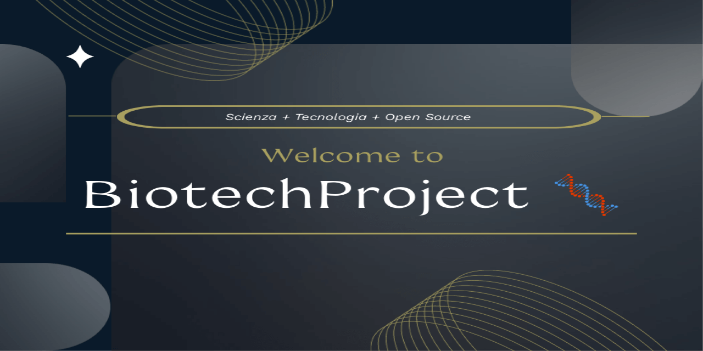

  

# BiotechProject 🧬 🇧🇷

🌐 **Leia em outros idiomas:**  
[Italiano 🇮🇹](README.it.md) | 
[English 🇬🇧](README.md) | 
[Español 🇪🇸](README.es.md) | 
[Français 🇫🇷](README.fr.md) | 
[Deutsch 🇩🇪](README.de.md) | 
[Dutch 🇳🇱](README.nl.md) |
[Português (BR) 🇧🇷](README.pt-br.md)

> 🌍 *"Nem todos falamos a mesma língua, mas falamos a mesma linguagem: colaboração."*  
> O inglês não é uma barreira — é uma ponte.  
> 🔹 Para contribuir ou revisar as diretrizes do projeto, acesse os arquivos principais em inglês:  
> - [Diretrizes de Contribuição](CONTRIBUTING.md)  
> - [Código de Conduta](CODE_OF_CONDUCT.md)  
> Usar o inglês favorece a colaboração internacional.

**Um projeto de código aberto que une ciência, saúde e tecnologia web.**  
Onde a biotecnologia encontra a programação para criar ferramentas digitais voltadas à pesquisa e inovação.

---

## 🌱 O que é o BiotechProject?

BiotechProject é um **laboratório digital aberto** que combina **biotecnologia, saúde e desenvolvimento web** em um sistema integrado projetado para ser:

- 🔍 **Cientificamente confiável**
- 💻 **Tecnicamente robusto**
- 🌐 **Acessível a todos**, incluindo usuários com deficiência
- 🤝 **Aberto à colaboração global**

Foi criado para mostrar como a tecnologia pode servir à ciência e à saúde, garantindo acesso equitativo para todos — independentemente de habilidades sensoriais, cognitivas ou motoras.

É um espaço colaborativo para desenvolvedores, pesquisadores e entusiastas que desejam explorar **como a web pode se tornar uma ferramenta de inclusão e inovação científica**.

---

## 🚀 Principais Funcionalidades

✅ **Aberto por design**  
→ Aberto a contribuições, ideias e colaboração internacional

✅ **Fluxo de trabalho CI/CD integrado**  
→ Testes, análises e atualizações automáticas a cada alteração

✅ **Painel de desempenho automatizado**  
→ Análise contínua de todas as páginas com atualizações em `performance-data.json`

✅ **Filtro dinâmico por categoria**  
→ Interface interativa para explorar o status de maturidade tecnológica

✅ **Design responsivo e acessível**  
→ Funciona em todos os dispositivos, com foco em usabilidade e conformidade com as WCAG

---

## 📊 Monitorização da Qualidade Técnica

O projeto inclui um sistema automatizado para monitorizar a qualidade técnica das páginas, com atualizações diárias através do GitHub Actions.  
Desde setembro de 2025, foi implementado um **sistema avançado de rastreamento da maturidade tecnológica**, que combina dados reais e previsões para visualizar a evolução global do projeto.

### Funcionalidades do painel
- ✅ **Pontuação de desempenho** (0–100) por página
- ✅ **Tempo de carregamento** e estado de otimização
- ✅ **Nível de maturidade**: `optimized`, `compatible`, `needs-improvement`, `deprecated`
- 📈 **Gráfico de evolução** (dados históricos + previsão até 100%)
- 💾 **Exportação de dados** em JSON/CSV para análise externa
- 🕒 Atualização a cada 24 horas (ou manualmente via "Atualizar")
  
📊 O sistema mostra tanto o **estado atual do projeto** como uma **projeção realista para a conclusão do ciclo de desenvolvimento** (previsto para fevereiro de 2026), baseada em melhorias reais (ex: acessibilidade, experiência de utilizador, desempenho).

👉 Aceda ao painel em tempo real: [Tech_Maturity.html](https://gitechnolo.github.io/biotechproject/Tech_Maturity.html)   

---

## 🌐 Acessibilidade

O site é **conforme às Diretrizes WCAG 2.1 Nível AA** para todas as páginas principais.  
A conformidade foi verificada por meio de:

- Auditorias automatizadas (Lighthouse, axe, WAVE)
- Testes manuais com leitores de tela (NVDA, VoiceOver)
- Navegação completa por teclado (tab, shift+tab, enter, espaço, setas)
- Validação do código HTML pelo W3C
- Inspeção direta do código para estrutura semântica e uso correto de ARIA

O projeto é **parcialmente conforme ao Nível AAA**, especialmente em:
- Contraste de cores (a maioria do texto excede a proporção 7:1)
- Estrutura hierárquica de títulos
- Uso de textos alternativos descritivos

No entanto, alguns critérios AAA não são aplicáveis ou exigidos no contexto atual (ex. legendas para vídeos, linguagem simples estendida).   

📄 **Declaração completa de acessibilidade:**  
👉 [Ler Declaração de Acessibilidade (EN)](accessibility-en.html)  
👉 [Leggi la Dichiarazione di Accessibilità (IT)](accessibility-it.html)   

## 🌍 Gerenciamento Multilíngue (i18n)

O BiotechProject suporta **múltiplos idiomas** por meio de um sistema de tradução **modular, leve e acessível**, projetado para funcionar em páginas estáticas hospedadas no GitHub Pages.

O sistema permite:
- ✅ Traduzir conteúdos em tempo real  
- ✅ Lembrar o idioma escolhido entre as páginas (como Wikipedia ou Google)  
- ✅ Oferecer versões simplificadas para usuários com dislexia  
- ✅ Ser facilmente expandido por colaboradores  

### 🧩 Arquitetura do Sistema

- **Arquivos JSON modulares**: cada página tem seu próprio arquivo de tradução na pasta `lang/`  
- **Common.json**: contém textos compartilhados (menu, rodapé, botão de idioma)  
- **Sem backend**: tudo funciona com JavaScript puro  
- **LocalStorage**: o idioma selecionado é armazenado  
- **`data-lang-key`**: atributo HTML para identificar elementos traduzíveis  

### 📁 Estrutura da pasta `lang/`
  lang/
├── common.json               → menu, footer, pulsante lingua
├── home.json                 → index.html
├── progetti.json             → Progetti.html
├── staff.json                → Staff.html
├── marketing.json            → Marketing.html
├── tech_maturity.json        → Tech_Maturity.html
├── dermatologia.json         → Dermatologia.html e Dermatologia-semplice.html
├── cuore.json                → Cuore.html e Cuore-semplice.html
├── cellula.json              → Cellula.html e Cellula-semplice.html
├── apparato_digerente.json   → Apparato_digerente.html e -semplice.html
├── apparato_respiratorio.json → Apparato_respiratorio.html e -semplice.html
├── apparato_tegumentario.json → Apparato_tegumentario.html e -semplice.html
├── sistema_linfatico.json     → Sistema_linfatico.html e -semplice.html

## 💡 Deseja contribuir?

Você é bem-vindo!  
O BiotechProject é um **projeto aberto para todos**, inspirado no espírito colaborativo da Wikipedia.

🔹 Para começar:
- Leia as [**Diretrizes de Contribuição**](CONTRIBUTING.md)
- Siga o [**Código de Conduta**](CODE_OF_CONDUCT.md)

Você pode ajudar com:
- Conteúdo científico
- Melhorias técnicas ou de acessibilidade
- Traduções
- Relatos de erros e sugestões

Toda contribuição — grande ou pequena — ajuda a tornar a ciência mais acessível.

---

## 🛠️ Tecnologias Utilizadas
- HTML5 semântico
- CSS3 com propriedades personalizadas
- JavaScript puro (sem frameworks)
- ARIA 1.2 para interações dinâmicas
- GitHub Actions para CI/CD
- Lighthouse para monitoramento de desempenho

---

## 📄 Licença

📄 Licença: [CC BY 4.0](https://creativecommons.org/licenses/by/4.0/)  
Você é livre para compartilhar, adaptar e usar o projeto comercialmente, desde que **dê o devido crédito**.

---

## 🙌 Autor

Autor: **Fabrizio** ([@Gitechnolo](https://github.com/Gitechnolo))  
Projeto disponível em: [https://github.com/Gitechnolo/biotechproject](https://github.com/Gitechnolo/biotechproject)

> "Qualquer um pode contribuir. Basta respeitar a origem e continuar construindo com cuidado." 